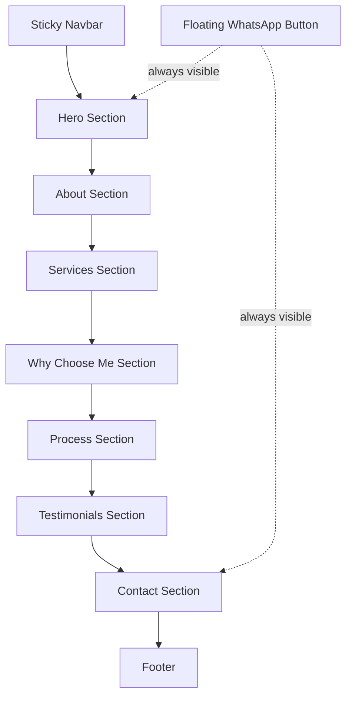

# Design Document: Insurance Advisor Portfolio

## Overview

This design adapts the existing `hailee-portfolio-website` into a static portfolio site for a Health & Medical Insurance Advisor. The output is additive HTML, CSS, and JS code that integrates into `index.html`, `assets/css/styles.css`, and `assets/js/main.js` without breaking existing functionality.

The site consists of ten sections: a sticky top Navbar, Hero, About, Services, Why Choose Me, Process, Testimonials, Contact, a floating WhatsApp button, and a Footer. All sections use the existing CSS custom properties, Boxicons, Swiper.js, and ScrollReveal already present in the project.

### Key Design Decisions

- The new Navbar is a **top sticky bar** (distinct from the existing bottom floating nav). The existing `.header`/`.nav` is replaced in the insurance advisor version of `index.html`. The existing bottom nav CSS is left intact so the original site is unaffected.
- All new CSS class names use the BEM-like convention already in the project (e.g. `ia-hero__title`, `ia-services__card`) prefixed with `ia-` to avoid collisions with existing classes.
- The existing `sr` ScrollReveal instance and `swiperTestimonial` Swiper pattern are reused directly.
- No new external CDN dependencies are introduced.

---

## Architecture

The feature is a pure static site — no build tools, no frameworks. The architecture is:

```
index.html          ← replace/extend with new section HTML blocks
assets/css/styles.css  ← append new CSS rules
assets/js/main.js      ← append new JS functions
assets/img/            ← reuse existing images
```

All sections are self-contained HTML blocks. CSS is additive (appended). JS is additive (appended).

### Mermaid: Page Section Flow



---

## Components and Interfaces

### 1. Sticky Navbar (`ia-navbar`)

- Logo text on the left, nav links on the right.
- On scroll > 50px: adds `.scroll-header` class (existing CSS already styles this with box-shadow).
- On mobile (< 768px): hamburger toggle shows/hides `.ia-navbar__menu`.
- Clicking a nav link on mobile closes the menu.
- Smooth scroll handled by `html { scroll-behavior: smooth }` (already in styles.css).

### 2. Hero Section (`ia-hero`)

- Full 100vh, gradient background using `--first-color`.
- Heading, subheading, CTA button.
- Fade-in-up CSS animation on page load (keyframe `fadeInUp`).
- CTA links to `#contact`.

### 3. About Section (`ia-about`)

- Two-column layout on desktop (image left, text right).
- Three stat boxes (years experience, clients served, support availability).
- "Contact Me" button links to `#contact`.
- ScrollReveal: image from left, text from right.

### 4. Services Section (`ia-services`)

- Four cards: Health Insurance Planning, Policy Comparison, Claim Assistance, 1:1 Consultation.
- Each card: Boxicon, title, description.
- 2-col mobile → 4-col desktop (992px+).
- Hover: `translateY(-6px)` + box-shadow lift.
- ScrollReveal: staggered fade-in-up per card.

### 5. Why Choose Me Section (`ia-why`)

- Three benefit items: Simple Explanations, Honest Advice, Personalized Support.
- Each item: icon + title + one-sentence description.
- Horizontal layout on desktop, stacked on mobile.
- ScrollReveal: staggered fade-in.

### 6. Process Section (`ia-process`)

- Four steps: Understand Your Needs, Compare Plans, Select the Best Option, Ongoing Support.
- Each step: number badge, title, description.
- Mobile: vertical timeline (steps stacked, left border line).
- Desktop (768px+): horizontal timeline (steps in a row, top border line).
- ScrollReveal: sequential fade-in.

### 7. Testimonials Section

- Reuses existing `.testimonial__container.swiper` markup and `swiperTestimonial` Swiper instance.
- Three cards with existing `testimonial1-3.png` images.
- New client names and quotes relevant to insurance advisory.

### 8. Contact Section (`ia-contact`)

- Three contact cards: Phone (`tel:`), Email (`mailto:`), WhatsApp (`https://api.whatsapp.com/send?phone=`).
- WhatsApp link opens in `target="_blank"`.
- Placeholders: `[phone_number]`, `[email]`, `[whatsapp_number]`.

### 9. Floating WhatsApp Button (`ia-whatsapp-float`)

- `position: fixed`, `bottom: 1.5rem`, `right: 1.5rem`.
- `z-index: var(--z-modal)` (above everything).
- Hover: `scale(1.15)` transition.

### 10. Footer (`ia-footer`)

- Background: `var(--first-color)`.
- Advisor name + tagline, social links (LinkedIn, Instagram, Facebook), copyright.

---

## Data Models

This is a static site — no dynamic data models. All content is hardcoded HTML. Placeholder values:

| Placeholder | Usage |
|---|---|
| `[phone_number]` | `tel:` link and display text |
| `[email]` | `mailto:` link and display text |
| `[whatsapp_number]` | WhatsApp API URL |

---

## Correctness Properties

*A property is a characteristic or behavior that should hold true across all valid executions of a system — essentially, a formal statement about what the system should do. Properties serve as the bridge between human-readable specifications and machine-verifiable correctness guarantees.*


### Property 1: Scroll header class applied after 50px

*For any* scroll position greater than or equal to 50px, the navbar element should have the `scroll-header` class applied; for any scroll position less than 50px, it should not.

**Validates: Requirements 1.2**

---

### Property 2: Hamburger menu open state shows nav links

*For any* viewport width below 768px, when the hamburger toggle is activated, the nav menu element should have the active/open class applied and the nav links should be visible.

**Validates: Requirements 1.4, 1.5**

---

### Property 3: Clicking a nav link closes the mobile menu

*For any* nav link clicked while the mobile menu is open, the menu should no longer have the active/open class after the click event fires.

**Validates: Requirements 1.6**

---

### Property 4: Hero section fills full viewport height

*For any* viewport size, the hero section's rendered height should be greater than or equal to `window.innerHeight` (100vh).

**Validates: Requirements 2.5**

---

### Property 5: Service cards contain required structure

*For any* service card in the services section, the card element should contain at least one icon element (Boxicon `<i>` tag), one title element, and one description element.

**Validates: Requirements 4.2**

---

### Property 6: Services grid is 2-col mobile, 4-col desktop

*For any* viewport width below 992px, the services container should render in a 2-column grid; at 992px and above, it should render in a 4-column grid.

**Validates: Requirements 4.4**

---

### Property 7: Why Choose items contain required structure

*For any* benefit item in the Why Choose Me section, the item element should contain an icon element and a description element.

**Validates: Requirements 5.2**

---

### Property 8: Process steps contain required structure

*For any* process step element, it should contain a step number, a title, and a description.

**Validates: Requirements 6.2**

---

### Property 9: Process timeline layout changes at 768px

*For any* viewport width below 768px, the process steps should be laid out vertically (flex-direction: column); at 768px and above, they should be laid out horizontally (flex-direction: row).

**Validates: Requirements 6.3**

---

### Property 10: Testimonial cards contain required structure

*For any* testimonial card, the card element should contain an `` element, a name element, and a quote/description element.

**Validates: Requirements 7.2**

---

### Property 11: Contact links use correct URI schemes

*For any* contact link in the contact section, a phone link's `href` should start with `tel:`, an email link's `href` should start with `mailto:`, and a WhatsApp link's `href` should start with `https://api.whatsapp.com/send?phone=`.

**Validates: Requirements 8.1, 8.2, 8.3, 8.4, 8.5, 8.6**

---

### Property 12: ScrollReveal animation duration does not exceed 800ms

*For any* ScrollReveal configuration used in the insurance advisor sections, the `duration` value should be less than or equal to 800.

**Validates: Requirements 11.2**

---

### Property 13: No horizontal overflow at any supported viewport width

*For any* viewport width between 320px and 1440px, `document.body.scrollWidth` should not exceed `window.innerWidth`.

**Validates: Requirements 12.3**

---

## Error Handling

- All contact links use placeholder values (`[phone_number]`, `[email]`, `[whatsapp_number]`) — the developer must replace these before deployment.
- The hamburger menu JS uses `?.classList` optional chaining to avoid null reference errors if the menu element is not found.
- The Swiper initialization is guarded: it only runs if `.testimonial__container` exists in the DOM, preventing console errors if the section is removed.
- ScrollReveal `sr.reveal()` calls are wrapped in a check for element existence to avoid errors on pages where sections are omitted.

---

## Error Handling

- All contact links use placeholder values (`[phone_number]`, `[email]`, `[whatsapp_number]`) — the developer must replace these before deployment.
- The hamburger menu JS uses optional chaining to avoid null reference errors if the menu element is not found.
- The Swiper initialization is guarded: it only runs if `.testimonial__container` exists in the DOM.
- ScrollReveal `sr.reveal()` calls target elements that exist in the new sections only.

---

## Testing Strategy

### Dual Testing Approach

Both unit tests and property-based tests are required for comprehensive coverage.

**Unit tests** cover specific examples and integration points:
- Navbar renders logo and nav links
- Hero section contains correct heading, subheading, and CTA text
- CTA button href points to `#contact`
- About section contains image with correct src, three stat boxes, and "Contact Me" button
- Services section contains exactly four cards
- Why Choose section contains at least three benefit items
- Process section contains exactly four steps
- Testimonials section contains exactly three cards
- Contact section contains `tel:`, `mailto:`, and WhatsApp links
- WhatsApp link has `target="_blank"`
- Floating WhatsApp button has `position: fixed` and correct z-index
- Footer contains social links for LinkedIn, Instagram, Facebook, and a copyright notice
- No new external CDN script/link tags are introduced
- ScrollReveal is initialized and `sr.reveal()` is called for each new section

**Property-based tests** verify universal behaviors across inputs:
- Properties 1–13 above, each implemented as a single property-based test
- Minimum 100 iterations per property test
- Use a property-based testing library appropriate for the target language (e.g., `fast-check` for JavaScript/TypeScript)

### Property-Based Test Configuration

Each property test must be tagged with a comment in the following format:

```
// Feature: insurance-advisor-portfolio, Property N: <property_text>
```

Example:
```js
// Feature: insurance-advisor-portfolio, Property 1: scroll header class applied after 50px
fc.assert(fc.property(fc.integer({ min: 50, max: 5000 }), (scrollY) => {
  simulateScroll(scrollY);
  return document.getElementById('ia-navbar').classList.contains('scroll-header');
}), { numRuns: 100 });
```

### Test File Location

- Unit tests: `hailee-portfolio-website/tests/unit/`
- Property tests: `hailee-portfolio-website/tests/property/`


---

## Implementation: HTML Markup

Each block below is a self-contained section to insert into `index.html`. Replace the existing `<header>` and `<main>` content with these blocks (or insert them into a new `index.html` for the insurance advisor version).

### Block 1: `<head>` additions (no changes needed — all libraries already present)

No new CDN links required. Existing Boxicons, Swiper CSS, and styles.css cover everything.

Update the `<title>` tag:
```html
<title>Insurance Advisor | Health & Medical Insurance</title>
```

### Block 2: Navbar (replaces existing `<header>`)

```html
<!--=============== NAVBAR ===============-->
<header class="ia-navbar" id="ia-navbar">
  <nav class="ia-navbar__nav container">
    <a href="#ia-home" class="ia-navbar__logo">InsureAdvisor</a>

    <div class="ia-navbar__menu" id="ia-navbar-menu">
      <ul class="ia-navbar__list">
        <li><a href="#ia-home"        class="ia-navbar__link">Home</a></li>
        <li><a href="#ia-about"       class="ia-navbar__link">About</a></li>
        <li><a href="#ia-services"    class="ia-navbar__link">Services</a></li>
        <li><a href="#ia-process"     class="ia-navbar__link">Process</a></li>
        <li><a href="#ia-contact"     class="ia-navbar__link">Contact</a></li>
      </ul>
    </div>

    <button class="ia-navbar__toggle" id="ia-navbar-toggle" aria-label="Toggle navigation">
      <i class='bx bx-menu'></i>
    </button>
  </nav>
</header>
```

### Block 3: Hero Section

```html
<!--=============== HERO ===============-->
<section class="ia-hero section" id="ia-home">
  <div class="ia-hero__container container">
    <div class="ia-hero__data">
      <span class="ia-hero__subtitle section__subtitle">Health &amp; Medical Insurance Advisor</span>
      <h1 class="ia-hero__title">Simplifying Health Insurance for You</h1>
      <p class="ia-hero__description">Less confusion, more clarity in your financial protection</p>
      <a href="#ia-contact" class="button ia-hero__cta">Get in Touch</a>
    </div>
  </div>
</section>
```

### Block 4: About Section

```html
<!--=============== ABOUT ===============-->
<section class="ia-about section" id="ia-about">
  <span class="section__subtitle">Who I Am</span>
  <h2 class="section__title">About Me</h2>

  <div class="ia-about__container container grid">
    

    <div class="ia-about__data">
      <div class="ia-about__stats">
        <div class="ia-about__stat-box">
          <i class='bx bx-award ia-about__icon'></i>
          <h3 class="ia-about__stat-title">Experience</h3>
          <span class="ia-about__stat-sub">10+ Years</span>
        </div>
        <div class="ia-about__stat-box">
          <i class='bx bx-group ia-about__icon'></i>
          <h3 class="ia-about__stat-title">Clients Served</h3>
          <span class="ia-about__stat-sub">500+ Families</span>
        </div>
        <div class="ia-about__stat-box">
          <i class='bx bx-support ia-about__icon'></i>
          <h3 class="ia-about__stat-title">Support</h3>
          <span class="ia-about__stat-sub">Always Available</span>
        </div>
      </div>

      <p class="ia-about__description">
        I believe every family deserves clear, honest guidance when it comes to health insurance.
        With over a decade of experience, I help individuals and families navigate complex policies,
        compare plans, and make confident decisions — without the jargon.
      </p>

      <a href="#ia-contact" class="button">Contact Me</a>
    </div>
  </div>
</section>
```

### Block 5: Services Section

```html
<!--=============== SERVICES ===============-->
<section class="ia-services section" id="ia-services">
  <span class="section__subtitle">What I Offer</span>
  <h2 class="section__title">My Services</h2>

  <div class="ia-services__container container grid">
    <div class="ia-services__card">
      <i class='bx bx-heart-circle ia-services__icon'></i>
      <h3 class="ia-services__title">Health Insurance Planning</h3>
      <p class="ia-services__description">Tailored health coverage plans that fit your family's needs and budget.</p>
    </div>

    <div class="ia-services__card">
      <i class='bx bx-search-alt ia-services__icon'></i>
      <h3 class="ia-services__title">Policy Comparison</h3>
      <p class="ia-services__description">Side-by-side comparison of top insurers so you always get the best deal.</p>
    </div>

    <div class="ia-services__card">
      <i class='bx bx-file ia-services__icon'></i>
      <h3 class="ia-services__title">Claim Assistance</h3>
      <p class="ia-services__description">End-to-end support during the claims process — I handle the paperwork for you.</p>
    </div>

    <div class="ia-services__card">
      <i class='bx bx-conversation ia-services__icon'></i>
      <h3 class="ia-services__title">1:1 Consultation</h3>
      <p class="ia-services__description">Personal one-on-one sessions to answer your questions and guide your decisions.</p>
    </div>
  </div>
</section>
```

### Block 6: Why Choose Me Section

```html
<!--=============== WHY CHOOSE ME ===============-->
<section class="ia-why section" id="ia-why">
  <span class="section__subtitle">Why Work With Me</span>
  <h2 class="section__title">Why Choose Me</h2>

  <div class="ia-why__container container grid">
    <div class="ia-why__item">
      <i class='bx bx-bulb ia-why__icon'></i>
      <div>
        <h3 class="ia-why__title">Simple Explanations</h3>
        <p class="ia-why__description">I break down complex insurance terms into plain language you can act on.</p>
      </div>
    </div>

    <div class="ia-why__item">
      <i class='bx bx-shield-quarter ia-why__icon'></i>
      <div>
        <h3 class="ia-why__title">Honest Advice</h3>
        <p class="ia-why__description">I recommend only what genuinely serves your interests — no hidden commissions.</p>
      </div>
    </div>

    <div class="ia-why__item">
      <i class='bx bx-user-check ia-why__icon'></i>
      <div>
        <h3 class="ia-why__title">Personalized Support</h3>
        <p class="ia-why__description">Every client gets a customized plan built around their unique health and financial situation.</p>
      </div>
    </div>
  </div>
</section>
```

### Block 7: Process Section

```html
<!--=============== PROCESS ===============-->
<section class="ia-process section" id="ia-process">
  <span class="section__subtitle">How It Works</span>
  <h2 class="section__title">My Process</h2>

  <div class="ia-process__container container">
    <div class="ia-process__step">
      <div class="ia-process__number">01</div>
      <div class="ia-process__content">
        <h3 class="ia-process__title">Understand Your Needs</h3>
        <p class="ia-process__description">We start with a free consultation to understand your health requirements, family size, and budget.</p>
      </div>
    </div>

    <div class="ia-process__step">
      <div class="ia-process__number">02</div>
      <div class="ia-process__content">
        <h3 class="ia-process__title">Compare Plans</h3>
        <p class="ia-process__description">I research and compare plans from leading insurers to find the best fit for you.</p>
      </div>
    </div>

    <div class="ia-process__step">
      <div class="ia-process__number">03</div>
      <div class="ia-process__content">
        <h3 class="ia-process__title">Select the Best Option</h3>
        <p class="ia-process__description">Together we review the shortlisted plans and you choose with full confidence.</p>
      </div>
    </div>

    <div class="ia-process__step">
      <div class="ia-process__number">04</div>
      <div class="ia-process__content">
        <h3 class="ia-process__title">Ongoing Support</h3>
        <p class="ia-process__description">I stay with you through renewals, claims, and any policy changes — for the long term.</p>
      </div>
    </div>
  </div>
</section>
```

### Block 8: Testimonials Section (reuses existing Swiper markup)

```html
<!--=============== TESTIMONIALS ===============-->
<section class="testimonial section" id="ia-testimonials">
  <span class="section__subtitle">What Clients Say</span>
  <h2 class="section__title">Testimonials</h2>

  <div class="testimonial__container container swiper">
    <div class="swiper-wrapper">
      <div class="testimonial__card swiper-slide">
        
        <h3 class="testimonial__name">Priya Sharma</h3>
        <p class="testimonial__description">
          "The advisor made the entire process so easy. I finally understand my policy and feel protected. Highly recommended!"
        </p>
      </div>

      <div class="testimonial__card swiper-slide">
        
        <h3 class="testimonial__name">Rahul Mehta</h3>
        <p class="testimonial__description">
          "When my father was hospitalised, the claim assistance was invaluable. Everything was handled smoothly and quickly."
        </p>
      </div>

      <div class="testimonial__card swiper-slide">
        
        <h3 class="testimonial__name">Anita Desai</h3>
        <p class="testimonial__description">
          "Honest, patient, and genuinely helpful. I got a plan that saved me ₹8,000 a year compared to what I had before."
        </p>
      </div>
    </div>
    <div class="swiper-pagination"></div>
  </div>
</section>
```

### Block 9: Contact Section

```html
<!--=============== CONTACT ===============-->
<section class="ia-contact section" id="ia-contact">
  <span class="section__subtitle">Reach Out</span>
  <h2 class="section__title">Contact Me</h2>

  <div class="ia-contact__container container grid">
    <div class="ia-contact__card">
      <i class='bx bx-phone ia-contact__icon'></i>
      <h3 class="ia-contact__title">Phone</h3>
      <span class="ia-contact__data">[phone_number]</span>
      <a href="tel:[phone_number]" class="ia-contact__link">
        Call Now <i class='bx bx-right-arrow-alt'></i>
      </a>
    </div>

    <div class="ia-contact__card">
      <i class='bx bx-envelope ia-contact__icon'></i>
      <h3 class="ia-contact__title">Email</h3>
      <span class="ia-contact__data">[email]</span>
      <a href="mailto:[email]" class="ia-contact__link">
        Send Email <i class='bx bx-right-arrow-alt'></i>
      </a>
    </div>

    <div class="ia-contact__card">
      <i class='bx bxl-whatsapp ia-contact__icon'></i>
      <h3 class="ia-contact__title">WhatsApp</h3>
      <span class="ia-contact__data">[whatsapp_number]</span>
      <a href="https://api.whatsapp.com/send?phone=[whatsapp_number]&text=Hi%2C%20I%20would%20like%20to%20know%20more%20about%20health%20insurance."
         target="_blank" rel="noopener noreferrer" class="ia-contact__link">
        Chat Now <i class='bx bx-right-arrow-alt'></i>
      </a>
    </div>
  </div>
</section>
```

### Block 10: Floating WhatsApp Button

```html
<!--=============== FLOATING WHATSAPP BUTTON ===============-->
<a href="https://api.whatsapp.com/send?phone=[whatsapp_number]&text=Hi%2C%20I%20would%20like%20to%20know%20more%20about%20health%20insurance."
   target="_blank" rel="noopener noreferrer"
   class="ia-whatsapp-float" aria-label="Chat on WhatsApp">
  <i class='bx bxl-whatsapp ia-whatsapp-float__icon'></i>
</a>
```

### Block 11: Footer

```html
<!--=============== FOOTER ===============-->
<footer class="ia-footer">
  <div class="ia-footer__container container">
    <h2 class="ia-footer__title">InsureAdvisor</h2>
    <p class="ia-footer__tagline">Your trusted partner in health &amp; medical insurance</p>

    <div class="ia-footer__social">
      <a href="#" target="_blank" rel="noopener noreferrer" class="ia-footer__social-link" aria-label="LinkedIn">
        <i class='bx bxl-linkedin'></i>
      </a>
      <a href="#" target="_blank" rel="noopener noreferrer" class="ia-footer__social-link" aria-label="Instagram">
        <i class='bx bxl-instagram'></i>
      </a>
      <a href="#" target="_blank" rel="noopener noreferrer" class="ia-footer__social-link" aria-label="Facebook">
        <i class='bx bxl-facebook'></i>
      </a>
    </div>

    <span class="ia-footer__copy">&#169; 2024 InsureAdvisor. All rights reserved.</span>
  </div>
</footer>
```


---

## Implementation: CSS (append to styles.css)

```css
/*=============== INSURANCE ADVISOR — NAVBAR ===============*/
.ia-navbar {
  position: fixed;
  top: 0;
  left: 0;
  width: 100%;
  background-color: var(--body-color);
  z-index: var(--z-fixed);
  transition: box-shadow 0.4s, background-color 0.4s;
}

.ia-navbar.scroll-header {
  box-shadow: 0 2px 16px hsla(0, 0%, 0%, 0.3);
}

.ia-navbar__nav {
  height: var(--header-height);
  display: flex;
  justify-content: space-between;
  align-items: center;
}

.ia-navbar__logo {
  color: var(--first-color);
  font-weight: var(--font-semibold);
  font-size: var(--h3-font-size);
  transition: color 0.3s;
}

.ia-navbar__logo:hover {
  color: var(--first-color-alt);
}

.ia-navbar__list {
  display: flex;
  align-items: center;
  column-gap: 2rem;
}

.ia-navbar__link {
  color: var(--text-color);
  font-size: var(--normal-font-size);
  font-weight: var(--font-medium);
  transition: color 0.3s;
}

.ia-navbar__link:hover,
.ia-navbar__link.active-link {
  color: var(--first-color);
}

.ia-navbar__toggle {
  display: none;
  background: none;
  color: var(--title-color);
  font-size: 1.5rem;
  cursor: pointer;
}

/* Mobile nav */
@media screen and (max-width: 767px) {
  .ia-navbar__toggle {
    display: flex;
    align-items: center;
  }

  .ia-navbar__menu {
    position: absolute;
    top: var(--header-height);
    left: 0;
    width: 100%;
    background-color: var(--container-color);
    padding: 1.5rem 1rem;
    border-bottom: 1px solid hsla(var(--second-hue), 32%, 16%, 0.5);
    transform: translateY(-120%);
    opacity: 0;
    pointer-events: none;
    transition: transform 0.4s, opacity 0.4s;
  }

  .ia-navbar__menu.ia-navbar__menu--open {
    transform: translateY(0);
    opacity: 1;
    pointer-events: auto;
  }

  .ia-navbar__list {
    flex-direction: column;
    row-gap: 1.25rem;
    align-items: flex-start;
  }
}

/*=============== INSURANCE ADVISOR — HERO ===============*/
.ia-hero {
  min-height: 100vh;
  display: flex;
  align-items: center;
  background: linear-gradient(
    135deg,
    hsla(var(--first-hue), var(--sat), var(--lig), 0.15) 0%,
    var(--body-color) 60%
  );
  padding-top: calc(var(--header-height) + 2rem);
}

.ia-hero__container {
  text-align: center;
}

.ia-hero__subtitle {
  display: block;
  margin-bottom: 0.75rem;
}

.ia-hero__title {
  font-size: var(--h1-font-size);
  color: var(--title-color);
  margin-bottom: 1rem;
  animation: iaFadeInUp 0.8s ease both;
}

.ia-hero__description {
  font-size: var(--normal-font-size);
  color: var(--text-color);
  margin-bottom: 2rem;
  animation: iaFadeInUp 0.8s ease 0.15s both;
}

.ia-hero__cta {
  animation: iaFadeInUp 0.8s ease 0.3s both;
}

@keyframes iaFadeInUp {
  from {
    opacity: 0;
    transform: translateY(30px);
  }
  to {
    opacity: 1;
    transform: translateY(0);
  }
}

@media screen and (min-width: 992px) {
  .ia-hero__title {
    font-size: var(--biggest-font-size);
    max-width: 700px;
    margin-left: auto;
    margin-right: auto;
  }

  .ia-hero__description {
    font-size: var(--h3-font-size);
    max-width: 500px;
    margin-left: auto;
    margin-right: auto;
  }
}

/*=============== INSURANCE ADVISOR — ABOUT ===============*/
.ia-about__container {
  row-gap: 2.5rem;
}

.ia-about__img {
  width: 220px;
  border-radius: 1.5rem;
  justify-self: center;
}

.ia-about__data {
  text-align: center;
}

.ia-about__stats {
  display: grid;
  grid-template-columns: repeat(3, 1fr);
  gap: 0.5rem;
  margin-bottom: 2rem;
}

.ia-about__stat-box {
  background-color: var(--container-color);
  border-radius: 0.75rem;
  padding: 0.75rem 0.5rem;
}

.ia-about__icon {
  font-size: 1.5rem;
  color: var(--first-color);
  margin-bottom: 0.5rem;
}

.ia-about__stat-title {
  font-size: var(--small-font-size);
  font-weight: var(--font-semibold);
}

.ia-about__stat-sub {
  font-size: var(--tiny-font-size);
  color: var(--text-color-light);
}

.ia-about__description {
  margin-bottom: 2rem;
  font-size: var(--normal-font-size);
  line-height: 1.7;
}

@media screen and (max-width: 320px) {
  .ia-about__stats {
    grid-template-columns: repeat(2, 1fr);
  }
}

@media screen and (min-width: 992px) {
  .ia-about__container {
    grid-template-columns: repeat(2, 1fr);
    align-items: center;
    column-gap: 4rem;
  }

  .ia-about__img {
    width: 350px;
  }

  .ia-about__data {
    text-align: initial;
  }

  .ia-about__stats {
    justify-content: initial;
    gap: 1.5rem;
  }

  .ia-about__description {
    padding-right: 2rem;
  }
}

/*=============== INSURANCE ADVISOR — SERVICES ===============*/
.ia-services__container {
  grid-template-columns: repeat(2, 1fr);
  gap: 1.5rem;
  padding-top: 1rem;
}

.ia-services__card {
  background-color: var(--container-color);
  border-radius: 1.25rem;
  padding: 2rem 1.5rem;
  text-align: center;
  transition: transform 0.3s, box-shadow 0.3s;
}

.ia-services__card:hover {
  transform: translateY(-6px);
  box-shadow: 0 8px 24px hsla(var(--first-hue), var(--sat), var(--lig), 0.2);
}

.ia-services__icon {
  font-size: 2.5rem;
  color: var(--first-color);
  margin-bottom: 1rem;
  display: block;
}

.ia-services__title {
  font-size: var(--h3-font-size);
  color: var(--title-color);
  margin-bottom: 0.75rem;
}

.ia-services__description {
  font-size: var(--small-font-size);
  color: var(--text-color);
  line-height: 1.6;
}

@media screen and (max-width: 320px) {
  .ia-services__container {
    grid-template-columns: 1fr;
  }
}

@media screen and (min-width: 992px) {
  .ia-services__container {
    grid-template-columns: repeat(4, 1fr);
    column-gap: 2rem;
  }
}

/*=============== INSURANCE ADVISOR — WHY CHOOSE ME ===============*/
.ia-why__container {
  row-gap: 1.5rem;
  padding-top: 1rem;
}

.ia-why__item {
  background-color: var(--container-color);
  border-radius: 1rem;
  padding: 1.5rem;
  display: flex;
  align-items: flex-start;
  column-gap: 1rem;
}

.ia-why__icon {
  font-size: 2rem;
  color: var(--first-color);
  flex-shrink: 0;
}

.ia-why__title {
  font-size: var(--h3-font-size);
  color: var(--title-color);
  margin-bottom: 0.25rem;
}

.ia-why__description {
  font-size: var(--small-font-size);
  color: var(--text-color);
  line-height: 1.6;
}

@media screen and (min-width: 630px) {
  .ia-why__container {
    grid-template-columns: repeat(3, 1fr);
    column-gap: 1.5rem;
  }
}

/*=============== INSURANCE ADVISOR — PROCESS ===============*/
.ia-process__container {
  padding-top: 1rem;
  display: flex;
  flex-direction: column;
  row-gap: 0;
}

.ia-process__step {
  display: flex;
  align-items: flex-start;
  column-gap: 1.25rem;
  padding: 1.5rem 0;
  position: relative;
}

/* Vertical timeline line */
.ia-process__step:not(:last-child)::after {
  content: '';
  position: absolute;
  left: 1.25rem;
  top: 4rem;
  bottom: 0;
  width: 2px;
  background-color: var(--first-color);
  opacity: 0.3;
}

.ia-process__number {
  width: 2.5rem;
  height: 2.5rem;
  border-radius: 50%;
  background-color: var(--first-color);
  color: var(--body-color);
  font-weight: var(--font-semibold);
  font-size: var(--small-font-size);
  display: flex;
  align-items: center;
  justify-content: center;
  flex-shrink: 0;
}

.ia-process__title {
  font-size: var(--h3-font-size);
  color: var(--title-color);
  margin-bottom: 0.4rem;
}

.ia-process__description {
  font-size: var(--small-font-size);
  color: var(--text-color);
  line-height: 1.6;
}

/* Horizontal timeline on desktop */
@media screen and (min-width: 768px) {
  .ia-process__container {
    flex-direction: row;
    column-gap: 0;
    align-items: flex-start;
    position: relative;
  }

  /* Horizontal connector line */
  .ia-process__container::before {
    content: '';
    position: absolute;
    top: 1.25rem;
    left: 2.5rem;
    right: 2.5rem;
    height: 2px;
    background-color: var(--first-color);
    opacity: 0.3;
  }

  .ia-process__step {
    flex: 1;
    flex-direction: column;
    align-items: center;
    text-align: center;
    padding: 0 1rem;
    row-gap: 1rem;
  }

  .ia-process__step::after {
    display: none;
  }

  .ia-process__content {
    padding-top: 0.5rem;
  }
}

/*=============== INSURANCE ADVISOR — CONTACT ===============*/
.ia-contact__container {
  grid-template-columns: 1fr;
  gap: 1.5rem;
  padding-top: 1rem;
  padding-bottom: 3rem;
}

.ia-contact__card {
  background-color: var(--container-color);
  border-radius: 1rem;
  padding: 2rem 1.5rem;
  text-align: center;
}

.ia-contact__icon {
  font-size: 2rem;
  color: var(--first-color);
  margin-bottom: 0.5rem;
  display: block;
}

.ia-contact__title {
  font-size: var(--h3-font-size);
  color: var(--title-color);
  margin-bottom: 0.25rem;
}

.ia-contact__data {
  display: block;
  font-size: var(--small-font-size);
  color: var(--text-color);
  margin-bottom: 1rem;
}

.ia-contact__link {
  color: var(--first-color);
  font-size: var(--small-font-size);
  font-weight: var(--font-medium);
  display: inline-flex;
  align-items: center;
  column-gap: 0.25rem;
  transition: color 0.3s;
}

.ia-contact__link:hover {
  color: var(--first-color-alt);
}

@media screen and (min-width: 630px) {
  .ia-contact__container {
    grid-template-columns: repeat(3, 1fr);
    column-gap: 1.5rem;
  }
}

/*=============== INSURANCE ADVISOR — FLOATING WHATSAPP ===============*/
.ia-whatsapp-float {
  position: fixed;
  bottom: 1.5rem;
  right: 1.5rem;
  width: 3.5rem;
  height: 3.5rem;
  background-color: #25d366;
  border-radius: 50%;
  display: flex;
  align-items: center;
  justify-content: center;
  z-index: var(--z-modal);
  box-shadow: 0 4px 16px rgba(37, 211, 102, 0.4);
  transition: transform 0.3s, box-shadow 0.3s;
}

.ia-whatsapp-float:hover {
  transform: scale(1.15);
  box-shadow: 0 6px 24px rgba(37, 211, 102, 0.5);
}

.ia-whatsapp-float__icon {
  font-size: 2rem;
  color: #ffffff;
}

/*=============== INSURANCE ADVISOR — FOOTER ===============*/
.ia-footer {
  background-color: var(--first-color);
  padding: 3rem 0 2rem;
}

.ia-footer__container {
  text-align: center;
}

.ia-footer__title {
  font-size: var(--h2-font-size);
  color: var(--body-color);
  margin-bottom: 0.5rem;
}

.ia-footer__tagline {
  font-size: var(--small-font-size);
  color: hsla(0, 0%, 100%, 0.8);
  margin-bottom: 1.5rem;
}

.ia-footer__social {
  display: flex;
  justify-content: center;
  column-gap: 1.25rem;
  margin-bottom: 2rem;
}

.ia-footer__social-link {
  background-color: var(--body-color);
  color: var(--first-color);
  width: 2rem;
  height: 2rem;
  border-radius: 0.35rem;
  display: inline-flex;
  align-items: center;
  justify-content: center;
  font-size: 1.1rem;
  transition: background-color 0.3s, color 0.3s;
}

.ia-footer__social-link:hover {
  background-color: var(--first-color-alt);
  color: #ffffff;
}

.ia-footer__copy {
  display: block;
  font-size: var(--smaller-font-size);
  color: hsla(0, 0%, 100%, 0.7);
}

/* Light theme overrides for insurance advisor sections */
.light-theme .ia-navbar {
  background-color: var(--body-color);
}

.light-theme .ia-navbar__menu {
  background-color: var(--container-color);
}

.light-theme .ia-services__card,
.light-theme .ia-about__stat-box,
.light-theme .ia-why__item,
.light-theme .ia-contact__card {
  box-shadow: 0 2px 16px hsla(var(--second-hue), 48%, 8%, 0.1);
}
```


---

## Implementation: JavaScript (append to main.js)

```js
/*=============== INSURANCE ADVISOR — NAVBAR SCROLL SHADOW ===============*/
// Reuses the existing scrollHeader pattern but targets the new ia-navbar element
function iaScrollHeader() {
  const navbar = document.getElementById('ia-navbar');
  if (!navbar) return;
  if (window.scrollY >= 50) {
    navbar.classList.add('scroll-header');
  } else {
    navbar.classList.remove('scroll-header');
  }
}
window.addEventListener('scroll', iaScrollHeader);

/*=============== INSURANCE ADVISOR — HAMBURGER MENU ===============*/
const iaNavbarToggle = document.getElementById('ia-navbar-toggle');
const iaNavbarMenu   = document.getElementById('ia-navbar-menu');

if (iaNavbarToggle && iaNavbarMenu) {
  // Toggle open/close
  iaNavbarToggle.addEventListener('click', () => {
    iaNavbarMenu.classList.toggle('ia-navbar__menu--open');
    // Swap icon between menu and close
    const icon = iaNavbarToggle.querySelector('i');
    if (icon) {
      icon.classList.toggle('bx-menu');
      icon.classList.toggle('bx-x');
    }
  });

  // Close menu when a nav link is clicked (mobile)
  iaNavbarMenu.querySelectorAll('.ia-navbar__link').forEach((link) => {
    link.addEventListener('click', () => {
      iaNavbarMenu.classList.remove('ia-navbar__menu--open');
      const icon = iaNavbarToggle.querySelector('i');
      if (icon) {
        icon.classList.add('bx-menu');
        icon.classList.remove('bx-x');
      }
    });
  });
}

/*=============== INSURANCE ADVISOR — ACTIVE NAV LINK ON SCROLL ===============*/
function iaScrollActive() {
  const iaSections = document.querySelectorAll('section[id^="ia-"]');
  const scrollY = window.pageYOffset;

  iaSections.forEach((section) => {
    const sectionHeight = section.offsetHeight;
    const sectionTop    = section.offsetTop - 58;
    const sectionId     = section.getAttribute('id');
    const navLink       = document.querySelector(`.ia-navbar__menu a[href="#${sectionId}"]`);

    if (!navLink) return;

    if (scrollY > sectionTop && scrollY <= sectionTop + sectionHeight) {
      navLink.classList.add('active-link');
    } else {
      navLink.classList.remove('active-link');
    }
  });
}
window.addEventListener('scroll', iaScrollActive);

/*=============== INSURANCE ADVISOR — SCROLL REVEAL ANIMATIONS ===============*/
// Reuses the existing `sr` ScrollReveal instance (duration capped at 800ms per Req 11.2)
if (typeof sr !== 'undefined') {
  const iaRevealConfig = { duration: 800, distance: '40px', reset: true };

  sr.reveal('.ia-hero__title, .ia-hero__description, .ia-hero__cta', {
    ...iaRevealConfig,
    origin: 'bottom',
    interval: 150,
  });

  sr.reveal('.ia-about__img', {
    ...iaRevealConfig,
    origin: 'left',
  });

  sr.reveal('.ia-about__data', {
    ...iaRevealConfig,
    origin: 'right',
  });

  sr.reveal('.ia-services__card', {
    ...iaRevealConfig,
    origin: 'bottom',
    interval: 100,
  });

  sr.reveal('.ia-why__item', {
    ...iaRevealConfig,
    origin: 'bottom',
    interval: 150,
  });

  sr.reveal('.ia-process__step', {
    ...iaRevealConfig,
    origin: 'bottom',
    interval: 200,
  });

  sr.reveal('.testimonial__container', {
    ...iaRevealConfig,
    origin: 'bottom',
  });

  sr.reveal('.ia-contact__card', {
    ...iaRevealConfig,
    origin: 'bottom',
    interval: 100,
  });

  sr.reveal('.ia-footer__container', {
    ...iaRevealConfig,
    origin: 'bottom',
  });
}
```

